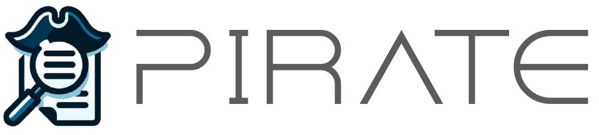

# Pirate



Pirate is a Python package that aims to be a unified framework for all things information retrieval. Currently, it serves as a go-to library for negative mining. The package provides a set of classes and methods to handle and manipulate data in various formats, making the process of information retrieval and negative mining easy and efficient.

## Installation

Pirate can be installed using pip. Simply run the following command:

```sh
pip install pirate
```

## Features

* **Data Handling:** Pirate provides classes like Passages, Queries, Triples, and Ranking to handle different types of data. These classes can load data from various formats such as JSON, CSV, and lists, and also save data to these formats.
* **Negative Mining:** Pirate is designed to make the process of negative mining easy and efficient. It provides methods to load and manipulate data, making it a powerful tool for negative mining tasks.

## Example Usage

Here's a simple example of how you can use the Passages class to load data from a JSON file:

```py
from pirate.data import Passages

# Load passages from a JSON file
passages = Passages("path_to_your_json_file.json") 
```

Same principle can be applied to load Queries, Triples, and Ranking data.

## Running Tests

Pirate uses pytest for testing. To run the tests, navigate to the project directory and run the following command:

```sh
PYTHONPATH=$PYTHONPATH:. pytest
```

This will run all the tests in the tests directory.

## Future Plans

While Pirate is currently focused on negative mining, the ultimate goal is to make it a comprehensive framework for all things related to information retrieval. Future updates will include more features and tools to handle a wider range of information retrieval tasks.

## License

Pirate is licensed under the Apache License 2.0. For more details, see the [LICENSE](./LICENSE) file.